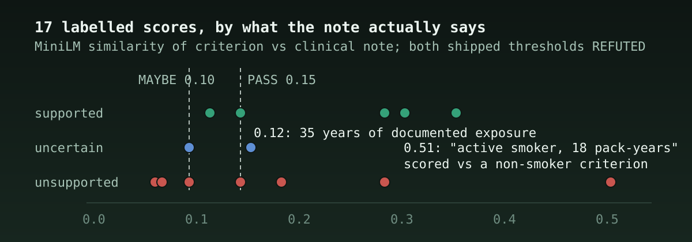
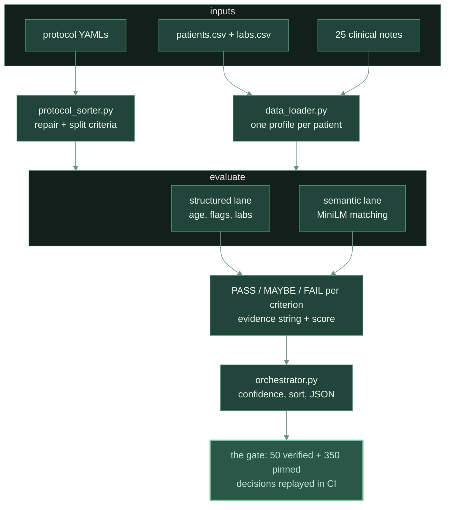
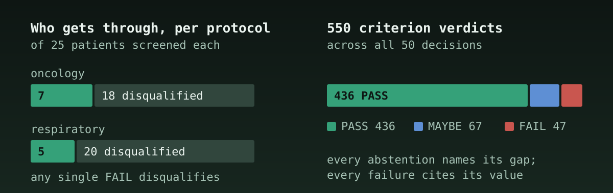

<p align="center"></p>

<div align="center">

<b><font size="6">Clinical Trial Eligibility Screening</font></b>

[](https://github.com/jameswniu/nlp-clinical-trial-eligibility-screening/actions/workflows/ci.yml)


<strong>A screening pipeline that abstains instead of guessing, and the eval harness that caught it guessing anyway.</strong>

The interesting part is not the matching.<br/>
It is that hand-checking all 50 shipped decisions caught 7 wrong admissions,<br/>
and the gate that caught them now runs in CI, guarding even its own refuted thresholds.

<code>normalize -> compare -> abstain-or-decide -> explain</code>

</div>

---

## The 90 second tour

Every verdict ships with its evidence, and CI replays the 50 verified decisions, the 350-decision pinned cohort, and the threshold audit on every push.

| if you want | go to |
| --- | --- |
| the decision a reviewer would audit | [Why the MAYBE verdict is the point](#why-the-maybe-verdict-is-the-point) |
| the bug the gate caught | [Hand-checking 50 shipped decisions caught 7 wrong admissions](#hand-checking-50-shipped-decisions-caught-7-wrong-admissions) |
| the claim the labels killed | [The labels refuted my own thresholds](#the-labels-refuted-my-own-thresholds) |
| the whole gate, free, in one command | [The gate CI actually runs](#the-gate-ci-actually-runs) |
| the cohort that stress-tests it | [Two tiers of golden data](#two-tiers-of-golden-data) |
| what is not claimed | [What this cannot tell you](#what-this-cannot-tell-you) |

## Why the MAYBE verdict is the point

A screening decision is one somebody else has to defend later. So the unit of output is a verdict with its receipt:

```
"HbA1c level must be less than 8.0%.":            "FAIL (HbA1c=8.1 not lt 8.0)"
"Patient must be between 50 and 70 years of age": "PASS (age=53 in range 50-70)"
"Spirometry FEV1 between 50-80% predicted.":      "MAYBE (no data for FEV1_percent)"
```

Three rules carry the safety weight:

- **Missing data abstains by name.** No FEV1 in the record yields `MAYBE (no data for FEV1_percent)`, never a silent pass. 67 of 550 shipped verdicts abstain, and each names its gap.
- **One FAIL disqualifies.** A patient with a disqualifying lab cannot be argued back in by strong matches elsewhere.
- **Confidence re-derives by hand.** It is the mean of PASS=1 and MAYBE=0.5. The dry-run gate recomputes every stored value from its own verdicts, so the formula cannot drift without CI noticing.

Unstructured criteria, like family history or occupational exposure, are matched against the clinical note with MiniLM embeddings, and the match score ships inside the evidence string. Similarity turned out to be a weak instrument. The refutation section below measures how weak.

## Hand-checking 50 shipped decisions caught 7 wrong admissions

The goldens were seeded from the pipeline's own outputs, then verified by hand against the raw records. That pass caught the oncology protocol admitting patients its lab criterion should have excluded.

The cause: the evaluator resolved a criterion's field through `field` and `type` but never `test_name`. Every lab criterion abstained with `no data for lab_result` while the HbA1c value sat loaded in the profile. MAYBE counts half instead of disqualifying, so the miss inflated 7 of 25 oncology admissions. Patients with HbA1c between 8.1 and 9.5 were reported eligible, at confidence up to 0.94, against a protocol requiring less than 8.0.

One line fixed it. 25 criterion verdicts changed, 7 eligibility decisions flipped, and the re-verified outputs are the goldens CI now replays. The caveat is real: 25 synthetic patients, one labeller. What lasts is not the 7, it is the audit that now runs on every push.

## The labels refuted my own thresholds

The semantic thresholds were supposed to be derived, not typed: label exemplar pairs by hand, then require each named constant to sit inside the interval its labels imply. `evals/derive.py` is that claim, executable. It came back with a verdict I did not want:

```
GATE                                     VALUE  BELOW EDGE ABOVE EDGE  STATUS
SEMANTIC_PASS                             0.15        0.51       0.12  REFUTED
SEMANTIC_MAYBE                            0.10        0.51       0.10  REFUTED
COSINE_PASS                               0.10           -          -  AUTHORED

0 of 3 named gating thresholds are DERIVED from labelled exemplars.
```

A criterion with no support anywhere in the note scores 0.29. A criterion the note supports explicitly, 35 years of documented occupational exposure, scores 0.12. The loudest row: "Must be non-smoker for at least 5 years" scores 0.51 on a patient whose note says active smoker, 18 pack-years. Cosine similarity sees the topic and cannot see the negation.

<p align="center"></p>

So no cutoff on that axis separates supported from unsupported. The split is pinned rather than hidden: `evals/derivation.expected.json` records 0 of 3 derived, and CI goes red if it moves either way without a re-review. Decision safety rests on the FAIL override and on abstention, which is what the labelled rows recommend.

## Architecture

<p align="center"></p>

Six small modules, one direction of flow, and a gate underneath the whole thing.

<details>
<summary>Mermaid source for this diagram</summary>



</details>

`protocol_sorter.py` repairs the protocol YAML and splits criteria into structured and unstructured. (The source files ship with a dangling list, deliberately kept.) `data_loader.py` builds one profile per patient: age from calendar arithmetic, smoker flag, most-recent lab per test, note text. `protocol_evaluator.py` runs the structured comparisons. `note_parser.py` tries a synonym shortcut, then MiniLM similarity, then a bag-of-words fallback. The orchestrator sorts eligible patients first by confidence and writes one JSON per protocol.

The embedding model loads lazily and the scorer is injectable. The deterministic core imports and tests without torch installed, which keeps the CI checks job at zero model downloads.

## The gate CI actually runs

Free tier first: no model, no network beyond pip. The `checks` job runs these commands, and `make ci` runs the same ones locally:

```
python -m pytest -m "not slow" -v      # 41 tests over the deterministic core
python evals/suite.py --dry-run        # goldens: 50 decisions, closed verdict
                                       # vocabulary, confidence re-derivation,
                                       # any-FAIL invariant, input schemas,
                                       # cohort trap audit vs the ledger
python evals/derive.py                 # thresholds vs labels, refutation pinned
python tools/readme_numbers.py --check # every counted number in this README
                                       # regenerates from its artifact
```

The `eval-full` job recomputes all 50 verified decisions with the real MiniLM stack and replays the 350-decision pinned cohort exactly. Eligibility and per-criterion verdicts must match the goldens exactly. Scores get a 0.02 tolerance, because embedding stacks differ across torch builds and a real regression moves a verdict, not a third decimal. Last recorded run: 50 of 50 decisions agree, 17 of 17 labelled scores re-measured within tolerance, 350 of 350 pinned decisions matched (`evals/last_full_run.json`, committed).

Threshold exemplars live in `evals/labels.csv`. Each row quotes the score the shipped output carries for that patient and criterion, and derive.py fails if any quoted score stops appearing verbatim. A label cannot drift from the artifact it cites.

## Two tiers of golden data

The two tiers carry different evidence and are never summed. Only tier 1 is called hand-verified.

**Tier 1, the verified goldens.** 25 patients, 50 decisions, every decision checked by hand against the raw records. This is the tier the agreement badge counts, and the tier that caught the 7 wrong admissions.

**Tier 2, the pinned regression cohort.** 175 generated patients at EHR-cohort-query scale, 350 pinned decisions replayed exactly in CI. The audit here is by construction, not exhaustive reading: the generator planted 70 traps and committed the manifest (`cohort/traps.json`), so verification means checking every trap landed where it was aimed, plus reading a seeded random sample of 10 clean decisions by hand.

The trap audit came back split, and the split is the finding:

- **40 of 40 structured traps behaved exactly as planted.** Borderline ages landed on their inclusive edges (50 and 70 pass, 49 and 71 fail), every missing lab abstained by name, every smoker mismatch followed the data over the prose.
- **30 of 30 semantic traps fooled the matcher.** Every planted negation ("has never once attempted to quit") and every explicit number ("motivation rated 2/10", "6 pack-years") produced a wrong PASS. The tier-1 refutation was 17 labels; this reproduces it at scale with a perfect hit rate.

Those 30 wrong verdicts are pinned in `evals/known_wrong.expected.json`, the known-wrong ledger. The dry run checks each ledger case still matches its planted trap and its pinned verdict, so a change that silently fixes or worsens one turns CI red until both files are re-audited together. A wrong verdict this pipeline is allowed to keep is one it must keep visibly.

Cohort provenance: the notes were written by an LLM against a fixed schema with per-batch trap quotas, then validated mechanically (ages recomputed from birth dates, note-lab consistency, id continuity, ASCII). `cohort/GENERATION.md` records the method. Zero PHI: every patient is invented.

## The batch profile

Throughput is machine-dependent, so it ships as a recorded measurement with its environment, not a CI assertion: `bench/receipt.json`, regenerated by `python3 bench/generate.py && python3 bench/run.py`.

Last recorded run: 35.3 patients/s over 1,000 generated patients (2,000 decisions in 28.3s), peak 873MB RSS, on an aarch64 Linux container, Python 3.12, torch 2.13 (cu130 wheel, CPU execution). Abstention rate was homogeneous across strata: 5.0% of criterion verdicts for smokers, 5.7% for nonsmokers. The 1,000-patient corpus is templated and seeded (never golden, never committed); it regenerates byte-identically from `bench/generate.py`.

## What measuring it taught

1. **The baseline can be the bug.** The committed outputs carried mojibake: the normalizer wrote `≥` as `≥` through a default-encoding write, and the corruption sat inside the regression baseline itself. Verify the goldens before trusting the goldens.
2. **Polite abstention can hide a dead feature.** The lab gate never ran, and `MAYBE (no data for lab_result)` read like caution rather than breakage. 7 of 25 admissions were wrong. Count what abstains, and ask why.
3. **A threshold you cannot derive is an opinion.** Labelling 17 exemplars took an evening and killed 2 of 3 thresholds. The result now lives in CI as a pinned expectation instead of in my head as an intention.
4. **Small formulas rot quietly.** `days // 365` overstated a patient's age by one year against her own clinical note. An uppercase `CHF` synonym key sat unreachable below a lowercasing lookup. The first real test pass caught both. Neither changed a decision; both are the kind that eventually does.
5. **Planting traps beats sampling for a known weakness.** The negation blindness was established on 17 labels; 30 planted traps confirmed it at a 100% hit rate, while all 40 deterministic traps passed clean. The failure is not random noise to sample for. It is a structural property of the instrument, and the ledger now holds its exact boundary.

## The numbers

<p align="center"></p>

| what | value | how it is known |
| --- | --- | --- |
| decisions in the golden gate | 50 decisions, 25 patients x 2 protocols | `python evals/suite.py --dry-run` |
| criterion verdicts / abstentions | 550 / 67 abstentions, each naming its gap | same dry run, counted from the goldens |
| full-model agreement | 50 of 50 decisions, 17 of 17 label scores within 0.02 | `python evals/suite.py --full`, receipt committed |
| tests, model-free | 41 tests | `python -m pytest -m "not slow"` |
| thresholds derived / refuted | 0 of 3 derived, 2 refuted by their own labels | `python evals/derive.py` |
| pinned cohort, tier 2 | 175 generated patients, 350 pinned decisions, 350 of 350 pinned replay | `python evals/suite.py --full`, receipt committed |
| the trap audit | 70 planted traps: 40 of 40 structured as planted, 30 known-wrong pinned | `cohort/traps.json` vs the pinned verdicts, checked every dry run |
| batch profile | 35.3 patients/s over 1,000, 873MB peak | `bench/receipt.json`, recorded with env fingerprint |
| wrong admissions caught | 7 of 25 oncology decisions flipped True to False | lab-gate fix, measured in the fixing commit's diff |
| bugs found while building the gate | 4 (encoding, lab gate, age drift, dead synonyms) | the commit history of this hardening pass |

`tools/readme_numbers.py --check` regenerates every counted row above from its artifact on every CI run, except the last two, which are historical measurements recorded in their commits.

## What ships here, and what does not

Everything runs on a fresh clone: pipeline, tests, both golden tiers, the trap audit, the bench, threshold derivation, Docker files, and all the data. Zero PHI by construction: every patient, note, and lab value is invented.

Not claimed: production traffic, clinician validation, or clinical validity of any decision. No LLM runs anywhere in the pipeline; screening is classical NLP plus sentence embeddings, chosen so every verdict stays re-derivable by hand. An LLM did author the tier-2 cohort's notes, offline, with a committed trap manifest, which is content provenance, not a runtime dependency.

## Quick start

Needs python3 and make. Docker is optional, and the ~60MB model download happens only on the full paths.

Free path, no model:

```bash
make setup        # venv + pinned deps + pytest
make test         # 41 tests, deterministic core only
make eval         # golden dry run + threshold derivation
```

Full pipeline:

```bash
make run          # evaluate all 25 patients against both protocols
make eval-full    # recompute tier 1 + replay the pinned cohort
```

Containerized:

```bash
make docker-build
make docker-run
```

## What this cannot tell you

- Whether a patient is actually eligible. The data is synthetic and no clinician has reviewed the criteria logic. This repo demonstrates decision auditability, not clinical truth.
- Whether a note asserts or denies a concept. Cosine similarity is negation-blind; the 0.51 active-smoker row proves it. Absence criteria, like "no personal history of malignancy", are matched by the very words they negate.
- Whether the thresholds generalize. They are refuted at 17 labels from one labeller. More labels would move the edges, and the harness exists so that moving them is a measured act.

## Roadmap

- Drift monitoring on the score distributions. Nothing here watches production, because nothing here is in production.
- Negation-aware matching, evaluated against the same labels that refuted the current thresholds.
- A second labeller for `evals/labels.csv`, so the refutation carries inter-rater weight.
- A small Streamlit review UI for the MAYBE queue.

## Project structure

```
data/                 tier 1: 25 synthetic patients, hand-verified decisions
  protocol_*.yaml     2 trial protocols (raw + normalized _clean variants)
cohort/               tier 2: 175 generated patients + traps.json manifest
src/                  loader, protocol sorter, evaluator, note parser, orchestrator
tests/                41 model-free tests + 1 marked-slow real-model test
evals/
  golden/             all 50 verified decisions, every one hand-checked
  cohort.expected.json      350 pinned cohort decisions, replayed in CI
  known_wrong.expected.json 30 pinned wrong verdicts, drift turns CI red
  labels.csv          17 labelled exemplars, each citing a shipped score
  derive.py           thresholds vs labels, refutation pinned and guarded
  suite.py            --dry-run (free, CI) and --full (model recompute)
bench/                seeded 1,000-patient generator + receipt.json
tools/readme_numbers.py   every counted number here, regenerated or failed
assets/               hand-authored SVGs, XML-checked in CI
output/               the shipped decision JSONs the goldens were seeded from
```

## License

Apache-2.0. NOTICE retained.
